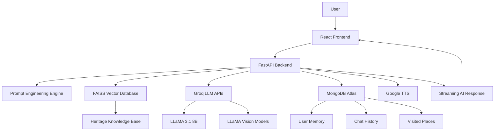

# 🏛️ AI-Powered Smart Heritage Guide for Tamil Nadu Tourism

An intelligent multilingual AI tourism assistant designed to provide personalized heritage exploration experiences across Tamil Nadu using **LLMs, RAG (Retrieval-Augmented Generation), Computer Vision, FastAPI, MongoDB, and Groq Cloud APIs**.

The system combines **real-time conversational AI**, **heritage knowledge retrieval**, **vision-based landmark understanding**, **voice storytelling**, and **personalized travel memory** into a single full-stack tourism platform.

---

# ✨ Features

## 🌍 Multilingual AI Assistant
Supports:
- English 🇬🇧
- Tamil 🇮🇳
- Hindi 🇮🇳

The chatbot dynamically generates responses in the selected language.

---

## 🧠 RAG-Powered Heritage Knowledge Retrieval
Uses:
- FAISS Vector Database
- HuggingFace Embeddings
- Semantic Similarity Search

The chatbot retrieves accurate heritage information before generating responses.

---

## 👁️ Vision-Based Heritage Recognition
Users can upload:
- Temple images
- Monuments
- Historical structures

The system analyzes images using:
- LLaMA Vision Models
- Multimodal AI pipelines

---

## 🗺️ Personalized Trip Planning
Generates:
- Day-wise travel itineraries
- Temple recommendations
- Stay suggestions
- Travel routes
- Cultural experiences

Based on:
- User location
- Travel duration
- Visited places
- User preferences

---

## 🧾 Storytelling Mode
Converts normal responses into immersive storytelling experiences suitable for:
- Audio narration
- Cultural learning
- Tourism engagement

---

## 🔊 Text-to-Speech (TTS)
Integrated with Google TTS for:
- Audio guidance
- Heritage narration
- Multilingual speech generation

---

## 👤 User Authentication & Memory
Features:
- User Signup/Login
- Chat History
- Personalized Recommendations
- Visited Place Tracking

Stored securely using MongoDB Atlas.

---

# 🏗️ System Architecture



---

# ⚙️ Tech Stack

## Frontend
- React 18
- Leaflet.js
- CSS
- JavaScript

---

## Backend
- FastAPI
- Uvicorn
- Python

---

## AI / ML
- LLaMA 3.1
- LLaMA Vision Models
- LangChain
- FAISS
- HuggingFace Embeddings
- Sentence Transformers

---

## Database
- MongoDB Atlas

---

## APIs & Services
- Groq Cloud API
- Google TTS

---

## Deployment
- Render
- GitHub

---

# 🧠 How the AI System Works

## Step 1 — User Query
The user sends:
- Text query
- Optional image
- Language preference
- GPS coordinates

Example:

```json
{
  "message": "Plan a 3-day temple trip in Madurai",
  "language": "en",
  "latitude": 9.9252,
  "longitude": 78.1198
}
```

---

## Step 2 — Prompt Engineering
The backend dynamically creates structured prompts using:
- User history
- Visited locations
- Language rules
- Storytelling settings

Implemented in:

```text
prompt.py
```

---

## Step 3 — RAG Retrieval Pipeline

The query is converted into embeddings using:

```python
sentence-transformers/all-MiniLM-L6-v2
```

Then:
1. Semantic similarity search is performed
2. Relevant heritage knowledge is retrieved
3. Context is injected into the LLM prompt

Implemented in:

```text
rag_pipeline.py
```

---

# 🔍 RAG Architecture


---

# 👁️ Vision AI Workflow

If an image is uploaded:

1. Image converted to Base64
2. Sent to LLaMA Vision Model
3. Model identifies:
   - Temple
   - Architecture
   - Historical significance
4. AI generates contextual response

Supported model:

```text
llama-3.2-11b-vision-preview
```

---

# 🔄 Streaming Response System

The chatbot uses:
- FastAPI StreamingResponse
- Server-Sent Events (SSE)

This enables:
- Real-time token streaming
- ChatGPT-like experience
- Faster perceived response speed

---

# 🧾 Authentication System

## Features
- Signup
- Login
- Password Change
- Profile Update
- Account Deletion

Implemented using:
- MongoDB Atlas
- FastAPI endpoints

---

# 🗂️ Database Design

## MongoDB Collections

### Users
Stores:
- Name
- Email
- Password

### Messages
Stores:
- Chat history
- AI responses
- User prompts

### Visited Places
Stores:
- Personalized tourism memory
- Recommendation filtering

---

# 📡 API Endpoints

## Authentication

| Method | Endpoint | Description |
|---|---|---|
| POST | `/auth/signup` | User registration |
| POST | `/auth/login` | User login |
| GET | `/auth/me` | Current user |
| PUT | `/auth/profile` | Update profile |
| PUT | `/auth/password` | Change password |
| DELETE | `/auth/account` | Delete account |

---

## Chat

| Method | Endpoint | Description |
|---|---|---|
| POST | `/chat` | AI chat |
| GET | `/chat/history` | Chat history |
| DELETE | `/chat/history` | Clear history |

---

## Heritage APIs

| Method | Endpoint | Description |
|---|---|---|
| GET | `/heritage/sites` | Heritage locations |
| GET | `/heritage/festivals` | Festival information |

---

## User Memory

| Method | Endpoint | Description |
|---|---|---|
| POST | `/user/visit` | Add visited place |
| GET | `/user/visited` | Get visited places |
| DELETE | `/user/visit` | Remove visited place |

---

## TTS

| Method | Endpoint | Description |
|---|---|---|
| GET | `/tts` | Generate speech audio |

---

# 📁 Project Structure

```text
backend/
│
├── main.py
├── rag_pipeline.py
├── prompt.py
├── mongo_database.py
├── requirements.txt
├── .env
│
├── faiss_index/
│   ├── index.faiss
│   └── index.pkl
│
└── heritage_data/
```

---

# 🚀 Installation

## Clone Repository

```bash
git clone https://github.com/yourusername/project-name.git
```

---

## Create Virtual Environment

```bash
python -m venv venv
```

Activate:

### Windows
```bash
.\venv\Scripts\activate
```

### Linux/Mac
```bash
source venv/bin/activate
```

---

## Install Dependencies

```bash
pip install -r requirements.txt
```

---

## Setup Environment Variables

Create `.env`

```env
GROQ_API_KEY=your_key
MONGO_URI=your_mongodb_uri
```

---

## Run Backend

```bash
uvicorn main:app --reload
```

---

# ☁️ Deployment

## Backend
Deploy using:
- Render

Start Command:

```bash
uvicorn main:app --host 0.0.0.0 --port $PORT
```

---

# 📸 Example Outputs

## Example 1 — Trip Planning

### User
> Plan a 2-day Madurai temple trip

### AI Output
- Day-wise itinerary
- Temple history
- Hotel suggestions
- Food recommendations
- Maps links

---

## Example 2 — Vision AI

### User Uploads:
Temple image

### AI Response:
- Temple name
- Historical background
- Architectural style
- Cultural importance

---

## Example 3 — Storytelling Mode

### AI Output
Narrative-style heritage storytelling suitable for audio narration.

---

# 🎯 Key AI Concepts Used

- Retrieval-Augmented Generation (RAG)
- Semantic Search
- Vector Databases
- Prompt Engineering
- Multimodal AI
- Streaming LLM Responses
- Conversational Memory
- Vision-Language Models

---

# 🔮 Future Enhancements

- Voice-to-Voice Conversations
- AR-Based Heritage Navigation
- Offline RAG Support
- AI Tour Guide Avatar
- Festival Recommendation Engine
- Personalized Budget Planner
- Hotel & Transport Booking Integration

---

# 📊 Performance Highlights

- Sub-second response generation using Groq APIs
- Real-time streaming responses
- Semantic heritage retrieval using FAISS
- Multilingual conversational AI
- Personalized tourism recommendations

---

# 👨‍💻 Author

## Maharajmaran G
B.Tech Artificial Intelligence & Data Science

Skills:
- AI/ML
- LLM Engineering
- FastAPI
- RAG Systems
- LangChain
- MongoDB
- React
- Computer Vision

---

# 📜 License

This project is intended for educational, research, and portfolio purposes.

---

# ⭐ Acknowledgements

- Groq Cloud
- Hugging Face
- LangChain
- FastAPI
- MongoDB Atlas
- Sentence Transformers
- Open Source AI Community

